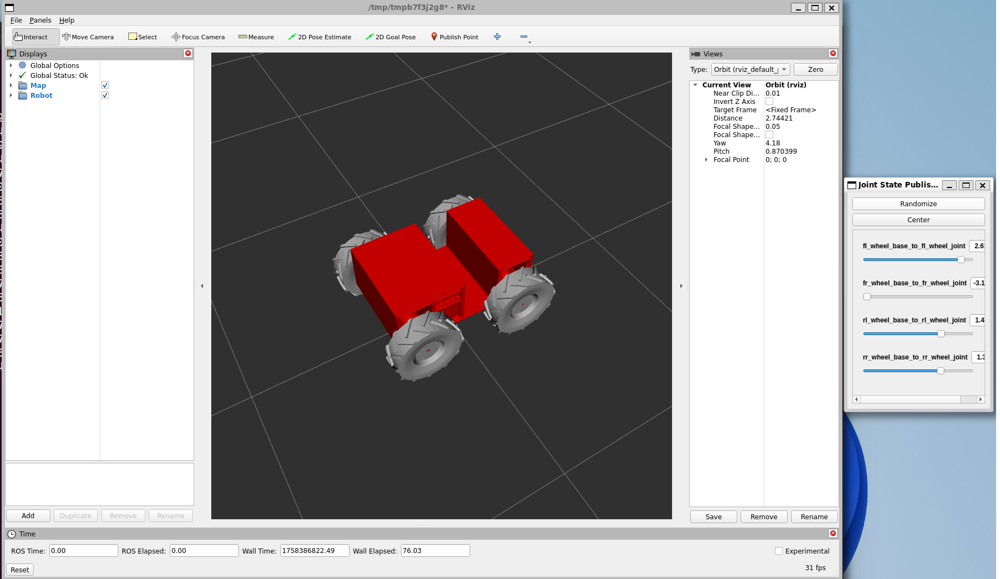

# rover_description

The package contains URDF files responsible for creating a representation of the robot.

## Launch Files

- `rover_load_urdf.launch.py` - loads the robot's URDF and creates simple bindings to display moving joints.

## Running

```bash
ros2 launch rover_description rover_load_urdf.launch.py
```

```bash
ros2 launch rover_description rover_rviz.launch.py
```

```bash
 ros2 run joint_state_publisher_gui joint_state_publisher_gui
```

## RViz: Rover



